Virtical Grammar rules

![[Pasted image 20250608102815.png]]


![[Pasted image 20250601061928.png]]

![[Pasted image 20250526075027.png]


![[Pasted image 20250526065637.png]]

![[Pasted image 20250526071209.png]]


![[Pasted image 20250525211546.png]]


![[Pasted image 20250525211600.png]]


![[Pasted image 20250525211656.png]]


1. zoom in/ot (words-phrases-parts)

2. increase/decrease (phrases chains)

  3.parallel running (words/phrases-parts)


concise,  real time, dynamic english grammar

image - list names - connect names using IR(intermediate representation/grammartical presentation) - manipulate IR(x: change order of subject/predicate,y: add/substract phrases to subject/predicate,z:possible changed to subject(type/numbers), predicate(type, states, time, person, numbers, parts))

-sentence - image


1. grammatical presentation of  English sentences

x-axis: 4 sentence types

y-axis: phrases(preoposition/gerun/infinites/)

z-axis: change subject(type/number) or predicate(type, state, number, person, times, parts)

  

2. tables

-noun tables

-verb tables

-pronoun tables -> mind map

-various phrase tables

  

3. mind map

level1(verb conjugate) -level2(change subject nouns type and number)-

 level3(add or reduce phrases for subject or predicate)- level4(change sentence type:statement/negative/yes or not/5W)-

level5(relative clauses:subject-subject/subject-predicate/subject-whole/predicate-subject/predicate-predicate/predicate-whole)


```markmap
---
markmap:
  height: 800
  colorFreezeLevel: 2
---
# Vertical Grammar Representation
## Core Components
### Names [5w, type, number, person(optional)]
#### What, Who, Where, When, Why, How
#### Types: indefinite/definite/proper noun, uncountable
#### Number: singular, plural
#### Person: first, second, third
### Decorators ()
#### Modify nouns
#### Types: color, age, material, size, other
### Connectors <>
#### Link two nouns
#### Types: space, time, other
### Times /type, tense, numbers(optional), person(optional)/
#### Type: be, do, have
#### Tense: past, present, future, perfect forms
#### Number: singular, plural
#### Person: first, second, third
### States |type, parts(optional)|
#### Type: still, active, passive, normal, etc.
#### Parts: hands, feet, body, head, etc.
```

```markmap
---
markmap:
  height: 800
  colorFreezeLevel: 2
---
# 縦型文法表現
## 主要要素
### 名前 [5W, 種類, 数, 人称(optional)]
#### 何（What）, 誰（Who）, どこ（Where）, いつ（When）, なぜ（Why）, どのように（How）
#### 種類: 不定名詞/定名詞/固有名詞/不可算名詞
#### 数: 単数, 複数
#### 人称: 一人称, 二人称, 三人称
### 修飾語 ()
#### 名詞を修飾する
#### 種類: 色, 年齢, 材質, 大きさ, その他
### 接続語 <>
#### 二つの名詞をつなぐ
#### 種類: 空間, 時間, その他
### 時制 /種類, 時制, 数(optional), 人称(optional)/
#### 種類: be動詞, 一般動詞, have動詞
#### 時制: 過去, 現在, 未来, 完了形
#### 数: 単数, 複数
#### 人称: 一人称, 二人称, 三人称
### 状態 |種類, 部分(optional)|
#### 種類: 静的, 能動的, 受動的, 通常, など
#### 部分: 手, 足, 体, 頭, など
```

## parts of sentences
English sentences are constructed of 5 parts, which are:
1. names, presented by []
2. decorators, presented by ()
3. connectors, presented by <>
4. times, presented by //
5. states, presened by ||

## 文のパーツ

英語の文は大きく **５つ** のパーツでできています。

1. **名前（Names）**：`[]` で囲みます
    
2. **飾り（Decorators）**：`()` で囲みます
    
3. **つなぎ（Connectors）**：`<>` で囲みます
    
4. **時（Times）**：`//` で囲みます
    
5. **状態（States）**：`||` で囲むこともあります

## names [5w, type, number, person(optional)]
Names has 3 attributes: 
1. 5W :  what, who, where, when, why, how
2. type : indefinite pronoun, definite pronoun, proper noun, uncountable, definite noun (tell instance), indefinite noun (tells class)
3. number: singular, plural
4. person(optional):  first, second, third

examples:
- a table[what, indefinite, singular]
- the cat[what, definite, singular]
- some books[what, indefinite, plural]
- Dr. Smith[who, proper noun, singular]
- the doctor[who, definite, singular]
- many people[who, indefinite, plural]
- the park[where, definite, singular]
- home[where, uncountable, singular]
- yesterday[when, uncountable, singular]
- the morning[when, definite, singular]
- a reason[why, indefinite, singular]
- this way[how, definite, singular]

## 名前（`[]`）

名前には次の３つの情報があります。

1. **５Ｗ（what, who, where, when, why, how）**
    
2. **種類（Type）**：
    
    - indefinite pronoun（不定代名詞）
        
    - definite pronoun（定代名詞）
        
    - proper noun（固有名詞）
        
    - uncountable（不可算名詞）
        
    - definite noun（特定の名詞）
        
    - indefinite noun（一般名詞）
        
3. **数（Number）**：singular（一つ）か plural（複数）
4. **人称（Person）**：first（一人称）/ second（二人称）/ third（三人称）    

**例**

- `a table[what, indefinite, singular]`
    
- `the cat[what, definite, singular]`
    
- `some books[what, indefinite, plural]`
    
- `Dr. Smith[who, proper noun, singular]`
    
- `home[where, uncountable, singular]`
    
- `yesterday[when, uncountable, singular]`
    
- `this way[how, definite, singular]`

### pronouns [5w, type, number, person]
pronouns are used to replace nouns:
- he/him/his: replaces a male noun
- she/her/hers: replaces a female noun
- it/its: replaces a non-human noun
- they/them/theirs: replaces a plural noun or a non-binary singular noun

## 代名詞（Pronouns）[5w, type, number, person]

代名詞は名詞の代わりに使われます。

- he/him/his: 男性名詞の代わり
- she/her/hers: 女性名詞の代わり
- it/its: 非人間名詞の代わり
- they/them/theirs: 複数名詞またはノンバイナリーの単数名詞の代わり

## decorators ()
decorators mofiy noun:
1. type: possible values are: color, age, material, size, other.


## 飾り（`()`）

名詞をくわしく説明する言葉です。

- **色(color)、年齢(age)、素材(material)、大きさ(size)、その他(other)**

## connectors <>
connectors are used to link two nouns:
1. type: possible values are: space, time, other.

## つなぎ（`<>`）

２つの名詞やフレーズをつなぎます。

- **空間(space)、時間(time)、その他(other)**


## times /type, times, numbers(optional), person(optional)/
1. type:  be, do, have
2. times: past, present, future, past perfect, present perfect, future perfect
3. numbers(optional): possible values are:singular, plural
4. person(optional): first, second, third.

examples:
- is/be, present, singular, third/
- am/be, present, sigular, first/
- are/be, present, plural, second/
- was/be, past, singular/
- were/be, past, plural/
- did/do, past/|normal|
- do/do,  present/|normal|
- does/do, present, singular, third/|normal|
- have been/be, present, plural/|passive|
- have done/do, present, plural/|passive|
- had been/be, past/|passive|
- had done/do, past/|passive|
- has been/be, present, singular, third/|passive|
- has done/do, present, singular, third/|passive|
- doing| active|
- being| active|
- walked/do, past/|normal, feet|
- walking| active, feet|
- walks/do,  singular, third/|normal, feet|
- has touched/do,  present, singular, third, hands/|passive, hands|
- had touched/do, past/|passive, hands|
- have watched/do, present, singular, third/|passive, eyes|
- will be/be, future/|still|
- will have been/be, future perfect/|passive|
- would/do, conditional/|normal|
- would be/be, conditional/|still|
- might/do, potential/|normal|
- might be/be, potential/|still|
- can/do, ability/|normal|
- can be/be, ability/|still|

## 時（`//`）

動詞の「いつ・どういうふうに」を表します。

1. **種類(type)**：be / do / have
    
2. **時制**（過去・現在・未来など）
    
3. **数**（単数 or 複数）
    
4. **人称**（一人称・二人称・三人称）
    
    

**例**

- `is/be, present, singular, third/`
    
- `did/do, past/`
    
- `has been/be, present, singular, third/|passive|`
    

## states |type, parts|
1. type: possible values are: still(to be),  active(gerund: being/doing), pasive(been/done), normal(do/does/did/will/would/might/can/could/should/must), potential(might/could), ability(can/could), obligation(should/must), necessity(must)

2. parts(optional): possible values are: hands, feet, body, head, heart, eyes, ears, nose, mouth, changes in space, changes in time.
## 状態（States）

## Japanese word-chain game
しりとり is usually called “shiritori”

Curtain over window
Window near table
Table against wall


Pencil on paper
Paper under book
Book on table
Table against wall


Food on dish
Dish on table
Table against wall


mother reading book
book on table
table in room
room in house
house with window
window with curtain
curtain behind window
cat under table
dish on table
food on dish

### steps to make action phrases
choose state -> choose parts -> choose action -> choose phrases

```markmap
---
markmap:
  height: 700
  reverseMarkmapOrder: true
---
# States of Action
## Still (to be)
### Mind
#### Thinking
##### [[boy]] thinking about [[work]]
##### [[boy]] thinking about [[school]]
#### Feeling
##### [[boy]] feeling happy
##### [[boy]] feeling tired
### Body
#### Standing
##### [[boy]] standing still
##### [[boy]] standing by the [[door]]
#### Sitting
##### [[boy]] sitting quietly
##### [[boy]] sitting in the [[room]]

## Active (doing)
### Feet/Legs
#### Walking
##### [[boy]] walking to [[school]]
##### [[boy]] walking in the [[garden]]
#### Running
##### [[boy]] running fast
##### [[boy]] running in the [[park]]
### Hands
#### Writing
##### [[boy]] writing a [[letter]]
##### [[boy]] writing on the [[board]]
#### Drawing
##### [[boy]] drawing a [[picture]]
##### [[boy]] drawing with [[crayons]]
### Voice/Mouth
#### Speaking
##### [[boy]] speaking to [[friend]]s
##### [[boy]] speaking loudly
#### Answering
##### [[boy]] answering the [[question]]
##### [[boy]] answering correctly

## normal (to do)
### Learning
#### At School
##### [[boy]] to learn at [[school]]
##### [[boy]] to learn math
#### About Subject
##### [[boy]] to learn about [[math]]
##### [[boy]] to learn about [[science]]
### Helping
#### Friends
##### [[boy]] to help [[friend]]s
##### [[boy]] to assist [[friend]]s
#### Family
##### [[boy]] to help [[family]]
##### [[boy]] to support [[family]]

## Passive (been/done)
### Taught
#### By Teacher
##### [[boy]] taught by [[teacher]]
##### [[boy]] being taught by [[teacher]]
#### At School
##### [[boy]] taught at [[school]]
##### [[boy]] being taught at [[school]]
### Helped
#### By Friends
##### [[boy]] helped by [[friend]]s
##### [[boy]] being helped by [[friend]]s
#### By Family
##### [[boy]] helped by [[family]]
##### [[boy]] being helped by [[family]]
```

動詞の働き方を表します。以下のいずれかを使います。

- still（to be の状態）
    
- active（動名詞：being, doing）
    
- passive（受動態：been, done）
    
- normal（通常形：do, does, did, will, would, might, can, could, should, must）
    
- potential（可能性：might, could）
    
- ability（能力：can, could）
    
- obligation（義務：should, must）
    
- necessity（必要性：must）
## phrase
1. type: possible values are: preposition, gerund, infinitive

## フレーズの種類

- **preposition**（前置詞句）
    
- **gerund**（動名詞句）
    
- **infinitive**（不定詞句）


## boundaries
using "-" to indicate word boundaries, 
using "->" to indicate phrase boundaries for subject, 
using "<-" to indicate phrase boundaries for predicate,
using "<=" or "=>" to indicate connection between subject and predicate,
using "+" to indicate boundaries between 2 clauses.

## sentence types
### statement

2)->[]
1)[]
3)<=//
4)<-||
5)<-[]

1) the-small-cat [what, definite, singular, third]  
2)<= does sit  /be, present, singular, third/  
3)<- under-the-table [where, definite, singular]  
4)<- in-the-room [where, definite, singular].  


**Example:**
2)-> in the blue suits[what, definite, singular]
2) the-student[who, definite, singular, third]
3)<= studies/do, present, singular, third/|normal, head|
4)<- mathematics[what, uncountable, singular]
5)<- at-school[where, definite, singular]

**English sentence:** The student in the blue suits studies mathematics at school.

.
.
.

### negative

2)->[]
1)[]
3)<=//not
4)<-||
5)<-[]
.
.
.

### yes or no question

1)=>//

3)->[]
2)[]
4)<-||
5)<-[]
.
.
.
### 5W question 

1)5w
2)=>//

4)->[]
3)[]
5)<-||
6)<-[]

**WH Questions based on example sentence:**

**What questions (for suits):**
1) What
2)<= does/do, present, singular, third/
4)-> the-student[who, definite, singular, third]
3)<= wear/do, present, singular, third/
5)<- at-school[where, definite, singular]
**English:** What does the student wear at school?

**Who questions (for student):**
1) Who
2)<= studies/do, present, singular, third/
4)<- mathematics[what, uncountable, singular]
5)<- at-school[where, definite, singular]
**English:** Who studies mathematics at school?

**What questions (for mathematics):**
1) What
2)<= does/do, present, singular, third/
4)-> the-student[who, definite, singular, third]
3)<= study/do, present, singular, third/
5)<- at-school[where, definite, singular]
**English:** What does the student study at school?

**Where questions (for school):**
1) Where
2)<= does/do, present, singular, third/
4)-> the-student[who, definite, singular, third]
3)<= study/do, present, singular, third/
5)<- mathematics[what, uncountable, singular]
**English:** Where does the student study mathematics?

**Alternative WH question (for suits - prepositional phrase):**
2)-> in what
1) the-student[who, definite, singular, third]
3)<= studies/do, present, singular, third/|normal, head|
4)<- mathematics[what, uncountable, singular]
5)<- at-school[where, definite, singular]
**English:** In what does the student study mathematics at school?
*OR*
**English:** What does the student study mathematics in at school?

.
.
.


### relative clauses in subject parts
#### conectors(wh, etc) of clauses are subject in relative clauses.

1-1)who  
 -2)<= teaches/do, present, singular, third/  
 -3)<- math[what, uncountable, singular]  
1)the-teacher[who, definite, singular, third]  
2)<= is/be, present, singular, third/  
3)<- very(degree)   kind|still|.  
---
1-1) which  
 -2)<= lives/do, present, singular, third/  
 -3)<- in-that-house[where, definite, singular]  
1) the-dog[what, definite, singular, third]  
2)<= barks/do, present, singular, third/  
3)<- at-night[when, uncountable, singular].  
----
1-1) that  
 -2)<= sits/do, present, singular, third/  
 -3)<- on-the-table[where, definite, singular]  
1) the-book[what, definite, singular, third]  
2)<= belongs/do, present, singular, third/  
3)<- to-the-student[who, definite, singular].  
----
1-1) who  
 -2)<= works/do, present, singular, third/  
 -3)<- at-the-store[where, definite, singular]  
1) the-man[who, definite, singular, third]  
2)<= speaks/do, present, singular, third/  
3)<- three-languages[what, definite, plural].  
----
1-1) which  
 -2)<= grows/do, present, singular, third/  
 -3)<- in-the-garden[where, definite, singular]  
1) the-tree[what, definite, singular, third]  
2)<= provides/do, present, singular, third/  
3)<- shade[what, uncountable, singular].  
----
1-1) that  
 -2)<= plays/do, present, singular, third/  
 -3)<- in-the-park[where, definite, singular]  
1) the-child[who, definite, singular, third]  
2)<= smiles/do, present, singular, third/  
3)<- all-the-time[when, definite, singular].  


#### conectors(wh, etc) of clauses are objects of predicate in relative clauses.

1-1)whom  
 -2)the-student[who, definite, singular, third]  
 -3)<= respects/do, present, singular, third/  
1)the-teacher[who, definite, singular, third]  
2)<= is/be, present, singular, third/  
3)<- very(degree) knowledgeable|still|.  
---
1-1)which  
 -2)the-boy[who, definite, singular, third]  
 -3)<= reads/do, present, singular, third/  
1)the-book[what, definite, singular, third]  
2)<= is/be, present, singular, third/  
3)<- very(degree) interesting|still|.  
---
1-1)that  
 -2)the-family[who, definite, singular, third]  
 -3)<= bought/do, past/  
1)the-house[where, definite, singular, third]  
2)<= needs/do, present, singular, third/  
3)<- renovation[what, uncountable, singular].  
----
1-1)whom  
 -2)the-children[who, definite, plural, third]  
 -3)<= love/do, present, plural/  
1)the-woman[who, definite, singular, third]  
2)<= bakes/do, present, singular, third/  
3)<- cookies[what, indefinite, plural].  
----
1-1)which  
 -2)the-girl[who, definite, singular, third]  
 -3)<= wrote/do, past/  
1)the-letter[what, definite, singular, third]  
2)<= arrived/do, past/  
3)<- yesterday[when, uncountable, singular].  
----
1-1)that  
 -2)the-doctor[who, definite, singular, third]  
 -3)<= recommended/do, past/  
1)the-medicine[what, definite, singular, third]  
2)<= helps/do, present, singular, third/  
1-1) why  
 -2)the-girl[who, definite, singular, third]  
 -3)<= missed/do, past/  
 -4)<- the-class[what, definite, singular]  
1) This[what, definite, singular]  
2)<= is/be, present, singular, third/  
3)<- what-her-mother[who, definite, singular, third]  
4)<- asked|still|.  
---
1-1) how  
 -2)the-man[who, definite, singular, third]  
 -3)<= built/do, past/  
 -4)<- the-house[what, definite, singular]  
1) That[what, definite, singular]  
2)<= impressed/do, past/  
3)<- the-visitors[who, definite, plural, third].  
---
1-1) when  
 -2)the-children[who, definite, plural, third]  
 -3)<= played/do, past/  
 -4)<- in-the-park[where, definite, singular]  
1) The-time[when, definite, singular]  
2)<= was/be, past, singular, third/  
3)<- very(degree) special()  

### relative clauses in predicate parts
#### conectors(wh, etc) of clauses are subject in relative clauses.

1)the-book[what, definite, singular, third]  
2)<= is/be, present, singular, third/  
3-1)<- which  
 -2)<= teaches/do, present, singular, third/  
 -3)<- basic-math[what, uncountable, singular].  
---
1)the-student[who, definite, singular, third]  
2)<= likes/do, present, singular, third/  
3-1)<- the-teacher[who, definite, singular]  
 -2)<= helps/do, present, singular, third/  
 -3)<- everyone[who, indefinite, singular].  
---
1)the-car[what, definite, singular, third]  
2)<= belongs/do, present, singular, third/  
3-1)<- to-my-friend[who, definite, singular]  
 -2)<= lives/do, present, singular, third/  
 -3)<- in-that-house[where, definite, singular].  

#### conectors(wh, etc) of clauses are objects of predicate in relative clauses.

----
1)the-food[what, definite, singular, third]  
2)<= tastes/do, present, singular, third/  
3)<- good|still|  
4-3)<- that  
 -1)my-mother[who, definite, singular, third]  
 -2)<= cooks/do, present, singular, third/.  
---
1)the-movie[what, definite, singular, third]  
2)<= was/be, past, singular, third/  
3)<- interesting|still|  
4-3)which  
 -1)we[who, definite, plural, first]  
 -2)<= watched/do, past/.  

#### conectors(wh, etc) are representing whole relative clauses.

1)He[who, definite, singular, third]  
2)<= arrived/do, past/  
3)<- late[when, uncountable, singular]  
4-1)<- which  
 -2)<= surprised/do, past/  
 -3)<- everyone[who, indefinite, plural].  
---
1)She[who, definite, singular, third]  
2)<= failed/do, past/  
3)<- the-test[what, definite, singular]  
4-1)<- which  
 -2)<= made/do, past/  
 -3)<- her[who, definite, singular, third]   (sad).  
---
1)The-team[who, definite, singular, third]  
2)<= won/do, past/  
3)<- the-game[what, definite, singular]  
4-1)<- which  
 -3)<= was/be, past, singular, third/  
 -4)<- unexpected|still|.  

1. type: possible values are: relative pronoun subject, relative pronoun object

## 関係節（Relative Clauses）

- **relative pronoun subject**（主格の関係代名詞）
    
- **relative pronoun object**（目的格の関係代名詞）
-
![[Pasted image 20250518061732.png]]
## presentation
we also can say that a english sentence is consisted of 2 parts, they are subject, predicats.
subject will be presetned by Red color, and predicats will be presented by Blue color.
## 表示のしかた

- 英語の文は「主語(subject)」と「述語(predicate)」の2つでできている。
    
- 主語を赤、述語を青で色分けするとわかりやすい。
## steps make a sentence
1. choose sentence type: statement, negative, yes or no question, 5W question
2. choose number and type for the subject 
3. choose decorators for the subject 
4. add 0 or more phrases to the subject, place then in the left order before the subject
5. choose time for the predicate
6. choose states for the predicate
7. choose 0 or more phrases for the predicate, place then in the right order after the predicate
8. keep subject and predicate stuck together.

## 文を作る8つのステップ

1. 文のタイプを選ぶ
    - 肯定文 / 否定文 / Yes/No 質問 / 5W 質問
        
2. 主語の数と種類を決める
    
3. 主語の修飾語（形容詞など）を選ぶ
    
4. 必要なら主語にフレーズを追加（前置詞句・動名詞句など）
    
5. 述語の時制を選ぶ（過去・現在・未来など）

6. 述語の状態（still, active, passive, normal など）を選ぶ
    
7. 必要なら述語にフレーズを追加（前置詞句・動名詞句など）
    
8. 主語と述語を = でつなぐ

```mermaid
sequenceDiagram
    actor User
    actor SentenceMaker

    SentenceMaker->>User: Choose sentence type
    User-->>User: Select Statement, Negative, Yes/No Question, 5W Question
    alt User->>SentenceMaker: Select Statement
        SentenceMaker-->>User: ask subject,  its type and number
        User-->>SentenceMaker: info Singular/Plural, Indefinite/Definite Pronoun, etc.
        SentenceMaker-->>User: ask adjectives for the subject
        User-->>SentenceMaker: info Color, Age, Material, etc.
        SentenceMaker-->>SentenceMaker: put the adjectives in front of the subject
        SentenceMaker-->>User: ask phrases
        User-->SentenceMaker: info preposition, Geround, Infinitive phrases
        loop for each phrase
            SentenceMaker-->>SentenceMaker: put the phrases to most left side of the subject phrase chain.
        end
        SentenceMaker-->>User: ask predicate 
        User-->>SentenceMaker: info Be, Do, Have
        User-->>SentenceMaker: info still, active, passive, normal
        User-->>SentenceMaker: info Past, Present, Future, etc.
        User-->>SentenceMaker: info hanns, feet, body, head, heart, eyes, ears, node, mouth, etc.
        SentenceMaker-->>SentenceMaker: put the predicate after the subject.
        SentenceMaker-->>User: ask for phrases for predicate
        User-->>SentenceMaker: info Preposition, Gerund, Infinitive
        loop for each phrase
            SentenceMaker-->>SentenceMaker: put the phrases to most right side of the predicate phrase chain.
        end
        SentenceMaker-->>User: return the sentence with grammar presentation
    else User->>SentenceMaker: Select Negative
        SentenceMaker-->>User: ask subject, its type and number
        User-->>SentenceMaker: info Singular/Plural, Indefinite/Definite Pronoun, etc.
        SentenceMaker-->>User: ask adjectives for the subject
        User-->>SentenceMaker: info Color, Age, Material, etc.
        SentenceMaker-->>SentenceMaker: put the adjectives in front of the subject
        SentenceMaker-->>User: ask predicate 
        SentenceMaker-->>User: ask phrases
        User-->SentenceMaker: info preposition, Geround, Infinitive phrases
        loop for each phrase
            SentenceMaker-->>SentenceMaker: put the phrases to most left side of the subject phrase chain.
        end
        User-->>SentenceMaker: info Be, Do, Have
        User-->>SentenceMaker: info still, active, passive, normal
        User-->>SentenceMaker: info Past, Present, Future, etc.
        SentenceMaker-->>SentenceMaker: negate the predicate
        SentenceMaker-->>User: ask for phrases for predicate
        User-->>SentenceMaker: info Preposition, Gerund, Infinitive
        loop for each phrase
            SentenceMaker-->>SentenceMaker: put the phrases to most right side of the predicate phrase chain.
        end
        SentenceMaker-->>User: return the sentence with grammar presentation
    else User->>SentenceMaker: Select Yes/No Question
        SentenceMaker-->>User: ask subject, its type and number
        User-->>SentenceMaker: info Singular/Plural, Indefinite/Definite Pronoun, etc.
        SentenceMaker-->>User: ask predicate 
        User-->>SentenceMaker: info Be, Do, Have
        User-->>SentenceMaker: info still, active, passive, normal
        User-->>SentenceMaker: info Past, Present, Future, etc.
        SentenceMaker-->>SentenceMaker: invert the predicate for question form
        SentenceMaker-->>User: ask phrases for subject
        User-->SentenceMaker: info preposition, Geround, Infinitive phrases
        loop for each phrase
            SentenceMaker-->>SentenceMaker: put the phrases to most left side of the predicate
        end
        SentenceMaker-->>User: ask for phrases for predicate
        User-->>SentenceMaker: info Preposition, Gerund, Infinitive
        loop for each phrase
            SentenceMaker-->>SentenceMaker: put the phrases to most right side of the predicate phrase chain.
        end
        SentenceMaker-->>User: return the sentence with grammar presentation
    else User->>SentenceMaker: Select 5W Question
        SentenceMaker-->>User: ask 5W word (Who, What, Where, When, Why)
        User-->>SentenceMaker: info 5W
        SentenceMaker-->>User: ask subject, its type and number
        User-->>SentenceMaker: info Singular/Plural, Indefinite/Definite Pronoun, etc.
        SentenceMaker-->>User: ask predicate 
        User-->>SentenceMaker: info Be, Do, Have
        User-->>SentenceMaker: info still, active, passive, normal
        User-->>SentenceMaker: info Past, Present, Future, etc.
        SentenceMaker-->>SentenceMaker: invert the predicate for question form
        SentenceMaker-->>User: ask phrases for subject
        User-->SentenceMaker: info preposition, Geround, Infinitive phrases
        loop for each phrase
            SentenceMaker-->>SentenceMaker: put the phrases to most left side of the wh- word
        end
        SentenceMaker-->>User: ask for phrases for predicate
        User-->>SentenceMaker: info Preposition, Gerund, Infinitive
        loop for each phrase
            SentenceMaker-->>SentenceMaker: put the phrases to most right side of the predicate phrase chain.
        end
        SentenceMaker-->>User: return the sentence with grammar presentation
    end
```



## examples
using sequence numbers to indicate the order of phrases in the sentence.

1)the-cats[what, definite, plural, third]  
2)<= are/be,  present, plural, third/  
3)<- chasing|do, active, body|  
4)<- a-mouse[what, indefinite, singular]  
5)<- in-the-garden[where, definite, singular].  
----
1)what  
2)=>is/be,  present, singular, third/  

4)-> with-blue-eyes  
3)the-cat[what, definite, singular, third]  
5)<- chasing|active, feet|?  
----
1)=>is/be,  present, singular, third/  

3)-> with-blue-eyes[what, indefinite, plural]  
2)the-small-cat[what, definite, singular, third]  
4)<- chasing| active, eyes|  
5)<- a-mouse[what, indefinite, singular]?  
----
1)a-cat[what, indefinite, singular]  
2)<= will-be/be,  future/  
3)<-sleeping| active, body|  
4)<- under-the-table[what, definite, singular].  
----
1)the-cats[what, definite, plural, third]  
2)<= are/be,  present, plural, third/  
3)<- chasing| active, body|  
4)<- a-mouse[what, indefinite, singular]  
5)<- in-the-garden[where, definite, singular]. 
----
2)->in-the-garden[where, definite, singular]  
1)some-cats[what, indefinite, plural]  
3)<= have-been/have,  present, plural/  
4)<- playing| active, body|  
5)<- with-the-ball[what, definite, singular].  
----
3)->with-green-eyes[what, indefinite, plural]  
2)-> in-the-garden[where, definite, singular]  
1)a-cat[what, indefinite, singular, third]  
4)<= is/be,  present, singular, third/  
5)<- chasing| active, body|  
6)<- a-mouse[what, indefinite, singular].  
----
1)a-cat[what, indefinite, singular, third]  
2)<= is/be,  present, singular, third/ –not  
3)<- chasing|do, active, body|  
4)<- a-mouse[what, indefinite, singular].  
----
1)=> is{be, still, present, singular, third}  
3)-> with-green-eyes[what, indefinite, plural]  
2)a-cat[what, indefinite, singular, third]  
4)<- chasing|do, active, body|  
5)<- a-mouse[what, indefinite, singular]?  
----

## Frequently Used Nouns

| Context     | Nouns                                                                 |
|-------------|----------------------------------------------------------------------|
| Home        | family, kitchen, bedroom, living room, furniture, television, food, bathroom, garden, pet |
| School      | teacher, student, classroom, book, desk, homework, exam, subject, library, playground |
| Town        | park, street, building, shop, car, bus, market, restaurant, square, station |
| Company     | employee, manager, office, meeting, project, report, computer, client, team, salary |
| Shopping    | store, product, price, cashier, cart, discount, receipt, customer, brand, item |
| Travel      | ticket, luggage, airport, hotel, destination, passport, map, guide, journey, tourist |
| Sports      | player, team, coach, game, ball, goal, match, stadium, referee, score |
| Hospital    | doctor, nurse, patient, medicine, bed, surgery, treatment, ward, appointment, diagnosis |

## Frequently Used Adjectives for Nouns

| Context     | Noun          | Adjectives                                      |
|-------------|---------------|-------------------------------------------------|
| Home        | family        | loving, supportive, close-knit, large, small   |
|             | kitchen       | modern, spacious, clean, organized, functional |
|             | bedroom       | cozy, comfortable, small, large, tidy          |
|             | furniture     | wooden, antique, modern, elegant, sturdy       |
|             | garden        | beautiful, lush, green, small, large           |
| School      | teacher       | experienced, strict, kind, knowledgeable, patient |
|             | student       | diligent, hardworking, bright, young, curious  |
|             | classroom     | spacious, clean, noisy, quiet, organized       |
|             | book          | interesting, educational, thick, thin, old     |
|             | library       | quiet, large, public, well-stocked, modern     |
| Town        | park          | beautiful, large, public, green, peaceful      |
|             | street        | busy, narrow, wide, clean, crowded             |
|             | building      | tall, old, modern, large, small                |
|             | shop          | small, local, busy, popular, expensive         |
|             | market        | crowded, local, busy, vibrant, open-air        |
| Company     | employee      | hardworking, skilled, experienced, young, dedicated |
|             | manager       | experienced, strict, supportive, efficient, approachable |
|             | office        | modern, spacious, clean, organized, small      |
|             | project       | challenging, important, large, small, innovative |
|             | team          | collaborative, skilled, diverse, hardworking, supportive |
| Shopping    | store         | large, small, busy, popular, expensive         |
|             | product       | high-quality, affordable, popular, new, innovative |
|             | price         | high, low, reasonable, competitive, discounted |
|             | customer      | loyal, regular, satisfied, new, potential      |
|             | brand         | popular, trusted, new, luxury, affordable      |
| Travel      | ticket        | expensive, cheap, valid, round-trip, one-way   |
|             | luggage       | heavy, light, large, small, lost               |
|             | hotel         | luxurious, affordable, clean, comfortable, modern |
|             | destination   | popular, exotic, beautiful, remote, famous     |
|             | journey       | long, short, safe, adventurous, tiring         |
| Sports      | player        | skilled, professional, young, experienced, talented |
|             | team          | strong, competitive, skilled, united, diverse  |
|             | game          | exciting, close, competitive, friendly, intense |
|             | stadium       | large, modern, crowded, famous, open-air       |
|             | score         | high, low, final, close, impressive            |
| Hospital    | doctor        | experienced, skilled, kind, professional, caring |
|             | nurse         | kind, caring, experienced, professional, patient |
|             | patient       | sick, injured, elderly, young, recovering      |
|             | medicine      | effective, prescribed, over-the-counter, expensive, generic |
|             | treatment     | effective, new, experimental, ongoing, successful |

## Frequently Used (Noun) + <Preposition> + (Noun) Phrases (Limited to 5)

| Context     | Noun          | Phrases                                                                 |
|-------------|---------------|-------------------------------------------------------------------------|
| Home        | family        | family of four, family with children, family in need, family at home, family on vacation |
|             | kitchen       | kitchen in the house, kitchen with appliances, kitchen for cooking, kitchen at home, kitchen under renovation |
|             | bedroom       | bedroom in the house, bedroom with a view, bedroom for guests, bedroom at the back, bedroom under the roof |
|             | furniture     | furniture in the room, furniture with cushions, furniture for the living room, furniture at the store, furniture under the tarp |
|             | garden        | garden in the backyard, garden with flowers, garden for relaxation, garden at the park, garden under the sun |
| School      | teacher       | teacher in the classroom, teacher with experience, teacher for math, teacher at school, teacher under training |
|             | student       | student in the class, student with potential, student for the project, student at the university, student under pressure |
|             | classroom     | classroom in the building, classroom with desks, classroom for learning, classroom at the school, classroom under construction |
|             | book          | book in the library, book with pictures, book for children, book at the store, book under review |
|             | library       | library in the school, library with books, library for research, library at the university, library under renovation |
| Town        | park          | park in the city, park with benches, park for children, park at the corner, park under the trees |
|             | street        | street in the town, street with shops, street for pedestrians, street at the corner, street under construction |
|             | building      | building in the city, building with offices, building for apartments, building at the corner, building under construction |
|             | shop          | shop in the market, shop with discounts, shop for clothes, shop at the mall, shop under renovation |
|             | market        | market in the town, market with stalls, market for vegetables, market at the square, market under the open sky |
| Company     | employee      | employee in the office, employee with skills, employee for the project, employee at the company, employee under probation |
|             | manager       | manager in the team, manager with experience, manager for the department, manager at the company, manager under pressure |
|             | office        | office in the building, office with a view, office for meetings, office at the headquarters, office under renovation |
|             | project       | project in progress, project with a deadline, project for the client, project at the company, project under review |
|             | team          | team in the office, team with skills, team for the project, team at the company, team under pressure |
| Shopping    | store         | store in the mall, store with discounts, store for electronics, store at the corner, store under renovation |
|             | product       | product in demand, product with features, product for sale, product at the store, product under warranty |
|             | price         | price in the market, price with discounts, price for the product, price at the store, price under negotiation |
|             | customer      | customer in the store, customer with complaints, customer for the product, customer at the counter, customer under service |
|             | brand         | brand in the market, brand with reputation, brand for the product, brand at the store, brand under scrutiny |
| Travel      | ticket        | ticket in hand, ticket with a discount, ticket for the journey, ticket at the counter, ticket under review |
|             | luggage       | luggage in the car, luggage with wheels, luggage for the trip, luggage at the airport, luggage under the seat |
|             | hotel         | hotel in the city, hotel with a view, hotel for tourists, hotel at the beach, hotel under renovation |
|             | destination   | destination in the itinerary, destination with attractions, destination for the vacation, destination at the end, destination under the radar |
|             | journey       | journey in the car, journey with friends, journey for the soul, journey at night, journey under the stars |
| Sports      | player        | skilled, professional, young, experienced, talented |
|             | team          | strong, competitive, skilled, united, diverse  |
|             | game          | exciting, close, competitive, friendly, intense |
|             | stadium       | large, modern, crowded, famous, open-air       |
|             | score         | high, low, final, close, impressive            |
| Hospital    | doctor        | experienced, skilled, kind, professional, caring |
|             | nurse         | kind, caring, experienced, professional, patient |
|             | patient       | sick, injured, elderly, young, recovering      |
|             | medicine      | effective, prescribed, over-the-counter, expensive, generic |
|             | treatment     | effective, new, experimental, ongoing, successful |

## Frequently Used (Noun) + <Preposition> + (Noun) Phrases (Limited to 5)

| Context     | Noun          | Phrases                                                                 |
|-------------|---------------|-------------------------------------------------------------------------|
| Home        | family        | family of four, family with children, family in need, family at home, family on vacation |
|             | kitchen       | kitchen in the house, kitchen with appliances, kitchen for cooking, kitchen at home, kitchen under renovation |
|             | bedroom       | bedroom in the house, bedroom with a view, bedroom for guests, bedroom at the back, bedroom under the roof |
|             | furniture     | furniture in the room, furniture with cushions, furniture for the living room, furniture at the store, furniture under the tarp |
|             | garden        | garden in the backyard, garden with flowers, garden for relaxation, garden at the park, garden under the sun |
| School      | teacher       | teacher in the classroom, teacher with experience, teacher for math, teacher at school, teacher under training |
|             | student       | student in the class, student with potential, student for the project, student at the university, student under pressure |
|             | classroom     | classroom in the building, classroom with desks, classroom for learning, classroom at the school, classroom under construction |
|             | book          | book in the library, book with pictures, book for children, book at the store, book under review |
|             | library       | library in the school, library with books, library for research, library at the university, library under renovation |
| Town        | park          | park in the city, park with benches, park for children, park at the corner, park under the trees |
|             | street        | street in the town, street with shops, street for pedestrians, street at the corner, street under construction |
|             | building      | building in the city, building with offices, building for apartments, building at the corner, building under construction |
|             | shop          | shop in the market, shop with discounts, shop for clothes, shop at the mall, shop under renovation |
|             | market        | market in the town, market with stalls, market for vegetables, market at the square, market under the open sky |
| Company     | employee      | employee in the office, employee with skills, employee for the project, employee at the company, employee under probation |
|             | manager       | manager in the team, manager with experience, manager for the department, manager at the company, manager under pressure |
|             | office        | office in the building, office with a view, office for meetings, office at the headquarters, office under renovation |
|             | project       | project in progress, project with a deadline, project for the client, project at the company, project under review |
|             | team          | team in the office, team with skills, team for the project, team at the company, team under pressure |
| Shopping    | store         | store in the mall, store with discounts, store for electronics, store at the corner, store under renovation |
|             | product       | product in demand, product with features, product for sale, product at the store, product under warranty |
|             | price         | price in the market, price with discounts, price for the product, price at the store, price under negotiation |
|             | customer      | customer in the store, customer with complaints, customer for the product, customer at the counter, customer under service |
|             | brand         | brand in the market, brand with reputation, brand for the product, brand at the store, brand under scrutiny |
| Travel      | ticket        | ticket in hand, ticket with a discount, ticket for the journey, ticket at the counter, ticket under review |
|             | luggage       | luggage in the car, luggage with wheels, luggage for the trip, luggage at the airport, luggage under the seat |
|             | hotel         | hotel in the city, hotel with a view, hotel for tourists, hotel at the beach, hotel under renovation |
|             | destination   | destination in the itinerary, destination with attractions, destination for the vacation, destination at the end, destination under the radar |
|             | journey       | journey in the car, journey with friends, journey for the soul, journey at night, journey under the stars |
| Sports      | player        | skilled, professional, young, experienced, talented |
|             | team          | strong, competitive, skilled, united, diverse  |
|             | game          | exciting, close, competitive, friendly, intense |
|             | stadium       | large, modern, crowded, famous, open-air       |
|             | score         | high, low, final, close, impressive            |
| Hospital    | doctor        | experienced, skilled, kind, professional, caring |
|             | nurse         | kind, caring, experienced, professional, patient |
|             | patient       | sick, injured, elderly, young, recovering      |
|             | medicine      | effective, prescribed, over-the-counter, expensive, generic |
|             | treatment     | effective, new, experimental, ongoing, successful |

## Frequently Used (Noun) + Gerund + Zero or One Noun Phrases

| Context     | Noun          | Phrases                                                                 |
|-------------|---------------|-------------------------------------------------------------------------|
| Home        | family        | family enjoying dinner, family celebrating together, family watching television, family preparing meals, family spending time |
|             | kitchen       | kitchen preparing food, kitchen hosting gatherings, kitchen serving meals, kitchen organizing utensils, kitchen cleaning surfaces |
|             | bedroom       | bedroom providing comfort, bedroom offering rest, bedroom storing clothes, bedroom creating privacy, bedroom maintaining order |
|             | furniture     | furniture enhancing decor, furniture supporting relaxation, furniture complementing style, furniture showcasing design, furniture providing utility |
| School      | teacher       | teacher explaining concepts, teacher guiding students, teacher preparing lessons, teacher evaluating work, teacher inspiring learners |
|             | student       | student completing assignments, student participating actively, student preparing for exams, student presenting projects, student learning skills |
|             | classroom     | classroom fostering learning, classroom hosting discussions, classroom encouraging collaboration, classroom displaying creativity, classroom maintaining discipline |
|             | book          | book providing knowledge, book inspiring imagination, book explaining topics, book narrating stories, book enhancing understanding |
| Town        | park          | park hosting events, park providing relaxation, park encouraging exercise, park showcasing nature, park supporting activities |
|             | street        | street bustling with activity, street showcasing culture, street connecting neighborhoods, street hosting markets, street supporting traffic |
|             | building      | building housing offices, building showcasing architecture, building providing shelter, building hosting businesses, building supporting infrastructure |
| Company     | employee      | employee contributing ideas, employee leading projects, employee supporting teams, employee achieving goals, employee improving processes |
|             | manager       | manager overseeing operations, manager guiding teams, manager implementing strategies, manager resolving issues, manager achieving targets |
|             | office        | office hosting meetings, office supporting productivity, office providing workspace, office encouraging collaboration, office maintaining order |
|             | project       | project achieving milestones, project meeting deadlines, project showcasing innovation, project improving efficiency, project supporting growth |

## Frequently Used (Noun) + Infinitive + Zero or One Noun Phrases

| Context     | Noun          | Phrases                                                                 |
|-------------|---------------|-------------------------------------------------------------------------|
| Home        | family        | family to support, family to cherish, family to visit, family to protect, family to nurture |
|             | kitchen       | kitchen to renovate, kitchen to clean, kitchen to organize, kitchen to use, kitchen to decorate |
|             | bedroom       | bedroom to sleep in, bedroom to relax in, bedroom to furnish, bedroom to paint, bedroom to tidy |
|             | furniture     | furniture to assemble, furniture to polish, furniture to move, furniture to buy, furniture to repair |
| School      | teacher       | teacher to guide, teacher to inspire, teacher to evaluate, teacher to mentor, teacher to consult |
|             | student       | student to teach, student to encourage, student to assess, student to help, student to guide |
|             | classroom     | classroom to study in, classroom to clean, classroom to organize, classroom to decorate, classroom to use |
|             | book          | book to read, book to borrow, book to write, book to review, book to recommend |
| Town        | park          | park to visit, park to relax in, park to walk in, park to enjoy, park to explore |
|             | street        | street to cross, street to walk on, street to clean, street to explore, street to drive on |
|             | building      | building to enter, building to construct, building to renovate, building to visit, building to admire |
| Company     | employee      | employee to hire, employee to train, employee to promote, employee to evaluate, employee to support |
|             | manager       | manager to consult, manager to lead, manager to assist, manager to evaluate, manager to guide |
|             | office        | office to work in, office to clean, office to organize, office to visit, office to renovate |
|             | project       | project to complete, project to start, project to manage, project to review, project to present |

## Frequently Used (Noun) + Past Participle + <Preposition> + (Noun)

| Context     | Noun          | Phrases                                                                 |
|-------------|---------------|-------------------------------------------------------------------------|
| Home        | family        | family reunited with relatives, family cherished by everyone, family supported by neighbors, family loved by all, family remembered in stories |
|             | kitchen       | kitchen cleaned by staff, kitchen renovated for modern use, kitchen organized with shelves, kitchen decorated with flowers, kitchen used for cooking |
|             | bedroom       | bedroom cleaned by the maid, bedroom furnished with antiques, bedroom painted in pastel colors, bedroom organized with care, bedroom used for relaxation |
|             | furniture     | furniture polished with wax, furniture repaired by a carpenter, furniture assembled with tools, furniture moved into the house, furniture bought from a store |
| School      | teacher       | teacher respected by students, teacher admired for knowledge, teacher consulted for advice, teacher remembered in gratitude, teacher supported by colleagues |
|             | student       | student praised for effort, student encouraged by mentors, student guided with patience, student assessed by teachers, student helped with assignments |
|             | classroom     | classroom cleaned by janitors, classroom organized with desks, classroom decorated with posters, classroom used for lectures, classroom renovated for better facilities |
|             | book          | book read by students, book borrowed from the library, book written by an author, book reviewed by critics, book recommended for reading |
| Town        | park          | park visited by families, park enjoyed by children, park explored by tourists, park maintained by the city, park cleaned by volunteers |
|             | street        | street cleaned by workers, street explored by pedestrians, street crossed by vehicles, street used for parades, street renovated for safety |
|             | building      | building constructed by engineers, building renovated for modern use, building admired for architecture, building visited by tourists, building used for offices |
| Company     | employee      | employee hired by the company, employee trained for the role, employee promoted to a higher position, employee evaluated by managers, employee supported by the team |
|             | manager       | manager consulted for decisions, manager respected by employees, manager supported by the board, manager evaluated for performance, manager remembered for leadership |
|             | office        | office cleaned by staff, office organized with files, office renovated for better facilities, office used for meetings, office visited by clients |
|             | project       | project completed by the team, project started with enthusiasm, project managed by experts, project reviewed for quality, project presented to stakeholders |

## Frequently Used Irregular Verbs

| Base Form  | Past Simple | Past Participle | Present Participle | Third Person Singular |
|------------|-------------|------------------|---------------------|-----------------------|
| be         | was/were    | been             | being               | is                   |
| become     | became      | become           | becoming            | becomes              |
| begin      | began       | begun            | beginning           | begins               |
| break      | broke       | broken           | breaking            | breaks               |
| bring      | brought     | brought          | bringing            | brings               |
| build      | built       | built            | building            | builds               |
| buy        | bought      | bought           | buying              | buys                 |
| catch      | caught      | caught           | catching            | catches              |
| choose     | chose       | chosen           | choosing            | chooses              |
| come       | came        | come             | coming              | comes                |
| do         | did         | done             | doing               | does                 |
| drink      | drank       | drunk            | drinking            | drinks               |
| drive      | drove       | driven           | driving             | drives               |
| eat        | ate         | eaten            | eating              | eats                 |
| fall       | fell        | fallen           | falling             | falls                |
| feel       | felt        | felt             | feeling             | feels                |
| find       | found       | found            | finding             | finds                |
| fly        | flew        | flown            | flying              | flies                |
| forget     | forgot      | forgotten        | forgetting          | forgets              |
| get        | got         | gotten           | getting             | gets                 |
| give       | gave        | given            | giving              | gives                |
| go         | went        | gone             | going               | goes                 |
| have       | had         | had              | having              | has                  |
| hear       | heard       | heard            | hearing             | hears                |
| hold       | held        | held             | holding             | holds                |
| keep       | kept        | kept             | keeping             | keeps                |
| know       | knew        | known            | knowing             | knows                |
| leave      | left        | left             | leaving             | leaves               |
| lose       | lost        | lost             | losing              | loses                |
| make       | made        | made             | making              | makes                |
| meet       | met         | met              | meeting             | meets                |
| pay        | paid        | paid             | paying              | pays                 |
| read       | read        | read             | reading             | reads                |
| run        | ran         | run              | running             | runs                 |
| say        | said        | said             | saying              | says                 |
| see        | saw         | seen             | seeing              | sees                 |
| sell       | sold        | sold             | selling             | sells                |
| send       | sent        | sent             | sending             | sends                |
| sit        | sat         | sat              | sitting             | sits                 |
| speak      | spoke       | spoken           | speaking            | speaks               |
| spend      | spent       | spent            | spending            | spends               |
| stand      | stood       | stood            | standing            | stands               |
| take       | took        | taken            | taking              | takes                |
| teach      | taught      | taught           | teaching            | teaches              |
| tell       | told        | told             | telling             | tells                |
| think      | thought     | thought          | thinking            | thinks               |
| understand | understood  | understood       | understanding       | understands          |
| wear       | wore        | worn             | wearing             | wears                |
| win        | won         | won              | winning             | wins                 |
| write      | wrote       | written          | writing             | writes               |

From the **infinitive point of view**, the sentences "I have a family to support" and "He has a good family to support him" differ in terms of the **function of the infinitive phrase**, **modification target**, and **grammatical role**. Here's a detailed breakdown:

---

### 1. **Infinitive Phrase Structure**
   - **"I have a family to support"**:  
     - The infinitive phrase is **"to support"**.  
     - It functions as an **adjective** modifying the noun **"family"**, describing the purpose or role of the family in the context of the speaker's responsibility.

   - **"He has a good family to support him"**:  
     - The infinitive phrase is **"to support him"**.  
     - It also functions as an **adjective** modifying the noun **"family"**, but it includes the object **"him"**, specifying the action of support directed toward **him**.

---

### 2. **Function of the Infinitive**
   - **"I have a family to support"**:  
     - The infinitive **"to support"** expresses **purpose** or **obligation**.  
     - It implies that the speaker has a duty or responsibility to provide support to their family.

   - **"He has a good family to support him"**:  
     - The infinitive **"to support him"** expresses **purpose** or **benefit**.  
     - It highlights the supportive role of the family and how it benefits **him**.

---

### 3. **Modification Target**
   - **"I have a family to support"**:  
     - The infinitive **"to support"** modifies **"family"**, describing the family as something that requires support from the speaker.

   - **"He has a good family to support him"**:  
     - The infinitive **"to support him"** modifies **"family"**, but it emphasizes the family's role in providing support to **him**.

---

### 4. **Grammatical Role of the Infinitive**
   - **"I have a family to support"**:  
     - The infinitive **"to support"** functions as an **adjective** that qualifies the noun **"family"**.  
     - It answers the question: **What kind of family?** (A family that needs support.)

   - **"He has a good family to support him"**:  
     - The infinitive **"to support him"** also functions as an **adjective** qualifying the noun **"family"**.  
     - However, it answers the question: **What kind of family?** (A family that provides support to him.)

---

### 5. **Focus of the Infinitive**
   - **"I have a family to support"**:  
     - The focus is on the **speaker's responsibility**.  
     - The infinitive **"to support"** emphasizes the speaker's role as the provider or caretaker.

   - **"He has a good family to support him"**:  
     - The focus is on the **family's supportive role**.  
     - The infinitive **"to support him"** emphasizes the benefit or assistance provided to **him** by the family.

---

### 6. **Emotional and Contextual Implications**
   - **"I have a family to support"**:  
     - The infinitive suggests a sense of **duty** or **obligation**.  
     - It implies that the speaker is responsible for the well-being of their family.

   - **"He has a good family to support him"**:  
     - The infinitive suggests a sense of **reliance** or **privilege**.  
     - It implies that **he** benefits from the care and support of his family.

---

### Summary Table:

| Aspect                  | "I have a family to support"                  | "He has a good family to support him"         |
|-------------------------|-----------------------------------------------|-----------------------------------------------|
| **Infinitive Phrase**    | "to support"                                 | "to support him"                              |
| **Function**            | Expresses obligation or purpose              | Expresses purpose or benefit                 |
| **Modification Target** | Modifies "family" (requires support)         | Modifies "family" (provides support)         |
| **Grammatical Role**    | Adjective qualifying "family"                | Adjective qualifying "family"                |
| **Focus**               | Speaker's responsibility                     | Family's supportive role                     |
| **Emotional Tone**      | Duty, obligation                             | Gratitude, reliance                          |

---

In conclusion, the key difference lies in the **direction of the action** implied by the infinitive: in the first sentence, the speaker is the one providing support, while in the second, the family is the one offering support to the subject.


various forms of frequently used irregular verbs

Frequently used (noun) + gerund (hands/foot/body/leg/changes/head/hearts/eyes/ears/nose/mouth perspective) + zero or 1 noun phrases
#english/grammar

#reviewis


## Sentence Variations for "the boy is running"
level1 is the sentence itself, level2 are sentence types, level3 adding preposition/gerund/infinties phrases to subject or predicte parts, level4 is verb conjugations. 

```markmap
# The boy is running

## Statement Type
### Simple Statement
#### Present
##### [[boy]] is running
#### Past
##### [[boy]] was running
#### Future
##### [[boy]] will run
### With Subject Phrases
#### Place for Subject
##### [[boy]] from [[school]] is running
##### [[boy]] in the [[house]] is running
#### Action for Subject
##### [[boy]] playing [[ball]] is running
##### [[boy]] reading a [[book]] is running
#### Purpose for Subject
##### [[boy]] to help [[mother]] is running
##### [[boy]] to meet [[friend]] is running
### With Predicate Phrases
#### Place for Predicate
##### [[boy]] is running in the [[house]]
##### [[boy]] is running to [[school]]
#### Action with Predicate
##### [[boy]] is running and reading a [[book]]
##### [[boy]] is running and talking to [[friend]]
#### Purpose for Predicate
##### [[boy]] is running to help [[mother]]
##### [[boy]] is running to see [[friend]]

## Question Type
### Yes/No Questions
#### Present Time
##### Is the [[boy]] running?
#### Past Time
##### Was the [[boy]] running?
#### Future Time
##### Will the [[boy]] run?
### What Questions
#### About Subject
##### Which [[boy]] is running?
##### What kind of [[boy]] is running?
#### About Action
##### Where is the [[boy]] running?
##### Why is the [[boy]] running?
##### When is the [[boy]] running?
##### How is the [[boy]] running?

## Negative Type
### Simple Negative
#### Present Time
##### [[boy]] is not running
#### Past Time
##### [[boy]] was not running
#### Future Time
##### [[boy]] will not run
### Subject Negative
#### No Subject
##### No [[boy]] is running
##### Not any [[boy]] is running
### Predicate Negative
#### No Place
##### [[boy]] is not running in the [[house]]
##### [[boy]] is not running to [[school]]
#### No Way
##### [[boy]] is not running fast
##### [[boy]] is not running well
```


